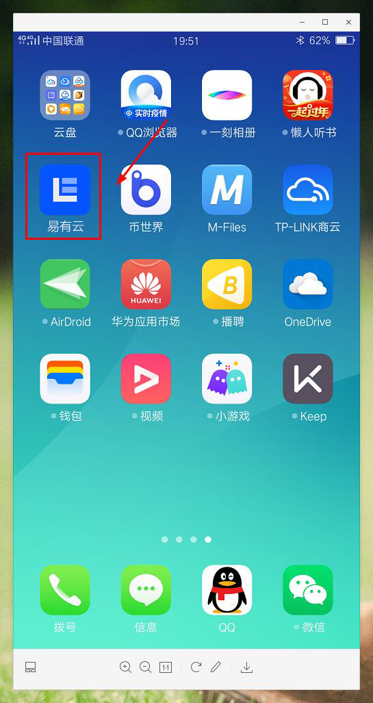
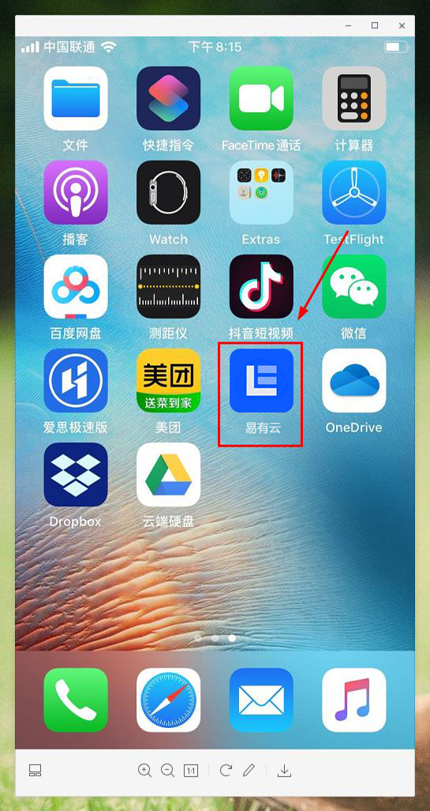
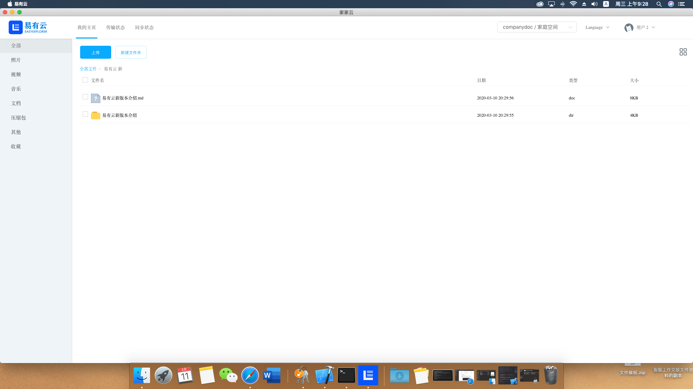
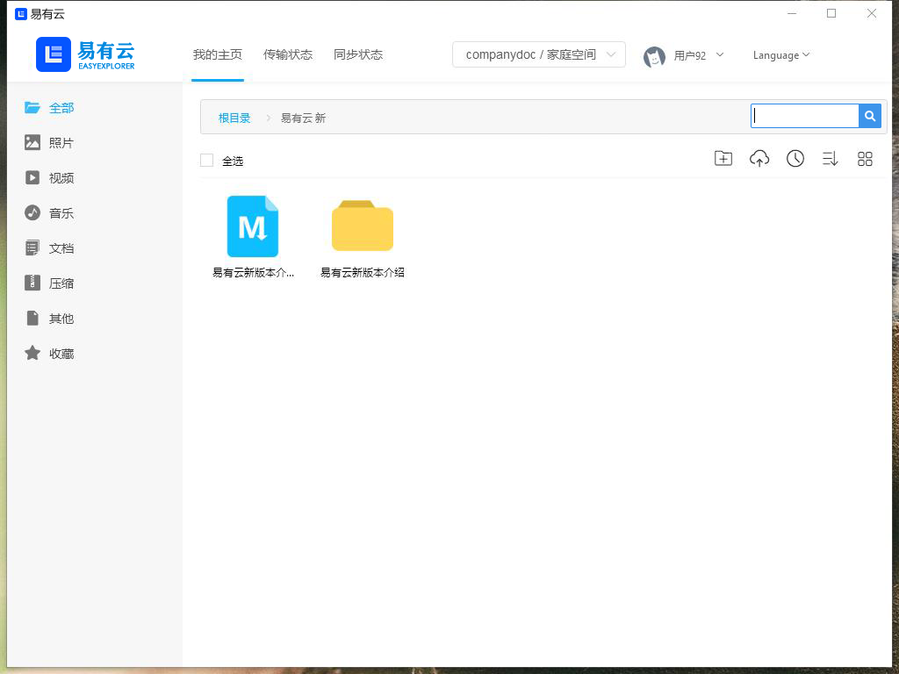
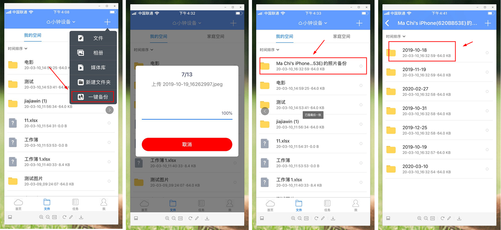
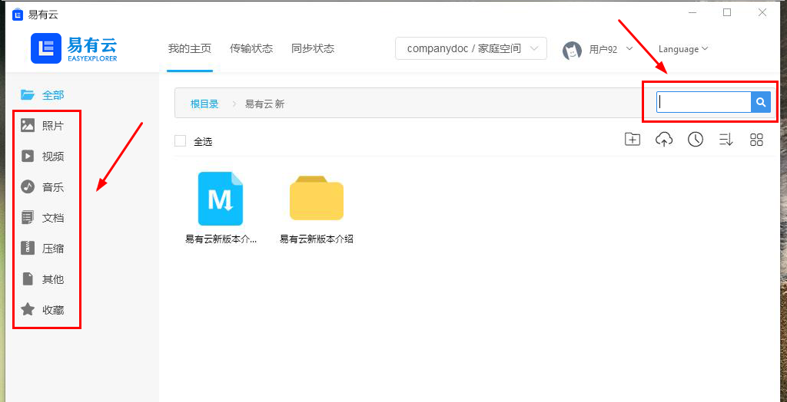
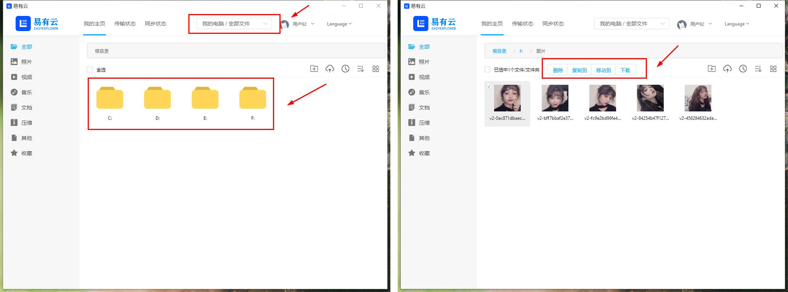
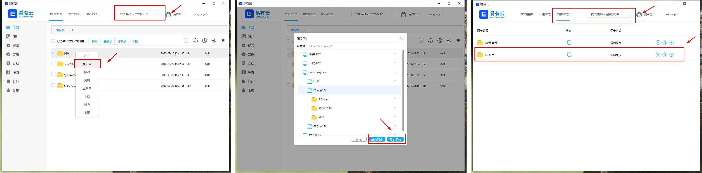
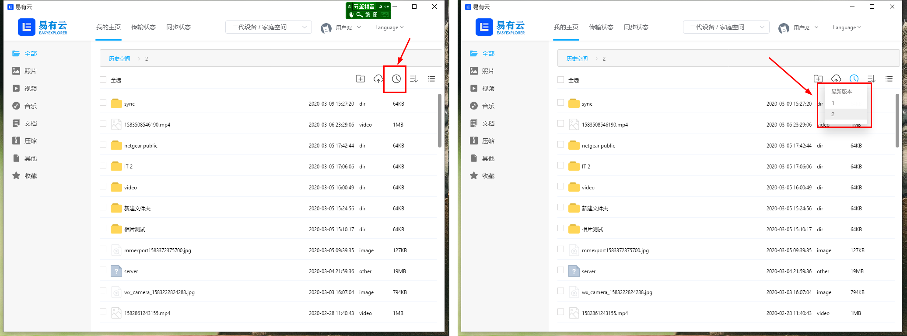

## 前言

易有云最近频繁崩，相信大家对它已经有一堆怨言了。为了重建大家的信心，又轮到我画饼大师亲自出马了！这次我就简单直接，介绍易有云最近几个月的开发成果，介绍我们如何让一个玩具，慢慢成长为一个产品的！

## 重述易有云理念

1. 让个人存储变得更简单，让个人数据变得更安全！
2. 我们不奢求太多，但是常用到的我们得简单拥有！

在内容为王的时候，个人数据变得越来越重要，很多大公司大团队都在帮大家解决个人存储的问题，但我使用起来痛点还是很多：

1. 从用户体验上来说，各界网盘因为经营成本高而限制严重；
2. 从数据安全上来说，文件数据全部存储在各大云盘，如果网盘跑路，自己也没有更多的控制权；
3. 从产品功能上来说，自己搭建 NAS，远程访问是个问题。国外的 NAS APP 说实话，不是太符合中国人的操作习惯，大多我都用不下去；
4. 从产品终端上来说，多平台同步数据时，需要各种大小不同的工具组合， iOS 一套，Android 一套，Windows 一套，电视一套；
5. 从产灵活度上来说，大多存储方案都实现得很重，依赖很多，入手难度很大；

## 易有云的产品思路
低成本研发，同时满足资深与小白用户个人及家庭

#### 支持绝大多数平台的开箱即用，价格高低都能体验存储的乐趣
1. Android 版本

2. iOS 版本

3. Mac 版本 

4. Windows 版本

5. Linux 服务器版本
6. 群晖、QNAP、ReadyNAS and more NAS
7. Koolshare 固件
8. TV (TODO)
[旧版本易有云下载汇总](https://github.com/koolshare/ddnsto#易有云下载汇总)

#### 多设备的通信，交给技术人员

易有云希望用户的设备或者终端一运行，就能自然的联通在一起，自动选择最好的线路（内网或者点对点）。

不需要用户设置端口转发，也不吹嘘浮躁世界的区块链技术，更也不搞带宽分享，我们只希望用户自己多个点的带宽能相互使用。

相信很多人都白嫖了 DDNSTO 功能两年多了，相信很多人也体验过旧版易有云的数据极致传输了！通信底层在两年前，在开发 KoolProxy 之前都开始准备了，因为 KoolProxy 耽搁了半年。

当然现在的底层通信还需要很多优化，等产品稳定，精力足够，我们会把它打磨得更好！

目前来说，用户个人及家庭日常需求我们都满足：

##### 支持多个存储设备在线绑定及共享

##### 支持跨设备的文件传输

##### iOS/Android 一键相册备份，且自动去重

##### 文件分类与搜索

##### 文件排序

##### 文件压缩、解压、图片缩略图展示 and so on

##### 独立客户端、全平台视频播放，支持外挂字幕

##### 支持PC端本地文件查看及管理

为了开发播放器，我曾经一周没睡好觉，闭眼睛就是各种代码。但是也终于开发出来了：

##### markdown 编辑器全力支持

此刻我正用它编辑当前的文件，核心支持下面几个特性：
1. 在线创建、编辑，截图能自动粘贴进入
2. 每个 markdown 都是独立的文件，复制到网站，能自动生成好看的网页版本
3. 能转换成独立的 pdf 或者 html

别的我们目前没精力做得太好，但当前这几个我自己够用了。如果未来大家喜欢，我可以加上索引，大家可以简单当个笔记或者博客功能用。比如这么玩：

1. 服务器运行一个易有云
2. 电脑上运行一个易有云
3. 设置一个双向同步到服务器，那么本地改了 markdown，就会自动同步到服务器，然后浏览器访问服务器的静态 html 会自动把 markdown 渲染成好看的网页
4. 内置的搜索引擎自动把 markdown 内容分析并生成关键词，加关键词索引信息等
5. 易有云历史版本功能会自动记录文件的修改记录，至少半年内的数据不会丢失

当然我只是畅想，不过目前仅仅缺失了第 4 点的功能而已。下文我就讲解两个专业功能！

#### 专业好用的核心功能我们支持 2 个

云盘我体验了很多，有众多有意思的特性！我体验下来，觉得核心两个功能特别好用：

###### 单向或者双向同步

公司改了一个文件，一保存就会触发文件更新，自动增量备份到家里。
未来易有云计划支持一些同步备份策略，比如每天什么时候触发两个文件夹的自动同步。用户可以借助这个功能实现数据的异地备份，很方便。

###### 历史版本备份

如果大家知道 svn 或者 git，则应该对这个功能很了解。是的，非常有用，所以我们开发了一个简化版本的 git！虽然都是文件仓库，但是我们的历史版本跟 git 有者本质的不同：

先说共同点：

1. 都支持历史版本，比如拿到一周前的文件或者整个文件夹的版本
2. 都基于一些增量文件的算法，让获取文件或文件夹的历史版本速度很快
3. 都可以快速切换历史版本，浏览历史版本的文件或视频

不同点：

1. 易有云文件仓库更着重历史备份，而不是 git 的代码管理。所以易有云文件仓库支持相册，大视频，各种大小的二进制文件的历史版本
2. 易有云文件仓库支持众多后端存储，而不仅仅是本地文件系统。易有云文件仓库支持把文件历史保存到各种云盘，对象存储，另外一台电脑的 samba 目录
3. 易有云文件仓库更省空间，因为是增量备份的技术，核心是存储增量变动的数据，所以如果用户备份了 100G 数据的半年的历史版本，空间可能只多出来 20%，也就是仓库用的空间 120G 左右。

当然也有缺点：
1. 功能不会那么多，因为精力有限，只支持基本的提交、恢复，浏览历史版本的文件，查看文件变动历史

## 易有云未来其它计划

###### 云盘同步功能

此功能到目前还在开发中

###### 个人加密文件夹

此功能可能还要很后期才开发，但是是我们核心要解决的问题！

### 打造一个细水长流的产品

* 说白了，不指望易有云能让我们突然就飞黄腾达，迎娶白富美，走向人生巅峰；
* 但是我们也不会因为易有云亏本太多，毕竟我们的核心成本在于研发，日常服务器运维，用户交流群维护，所以成本是可控的；
* 我们需要一个很长的时间来打造雕琢产品，希望大家给我们足够的耐心；
* 我们不搞各种恶心广告，下面这个《理性收费》章节希望用户支持

### 理性收费

* 易有云跟公有云不一样，如果除去研发成本，易有云是一个成本很低的产品，毕竟数据都在用户自己的硬盘上；
* 所以我们的收费会比公有云低很多很多。我们计划从公有云的 1/5 开始收费，未来会根据产品成熟度调整价格；
* 目前不从产品功能收费，本质就是研发成本不记费。对用户收费主要是我们当前的服务器，带宽，日常运维等也需要人力及物力成本；

就目前不从产品功能收费这一点，在我们团队内部争议很大。但是从我个人的技术角度来看，好用的不需要服务器的本地功能，大家想用就会去破解，然后我们还得防止大家破解，这日子就没法过了。所以简单点，只要没有服务器参与的，暂时不收费好了。

### 希望易有云能开放一些接口

让用户能借助易有云，对接一些流行的下载工具，动态脚本等。