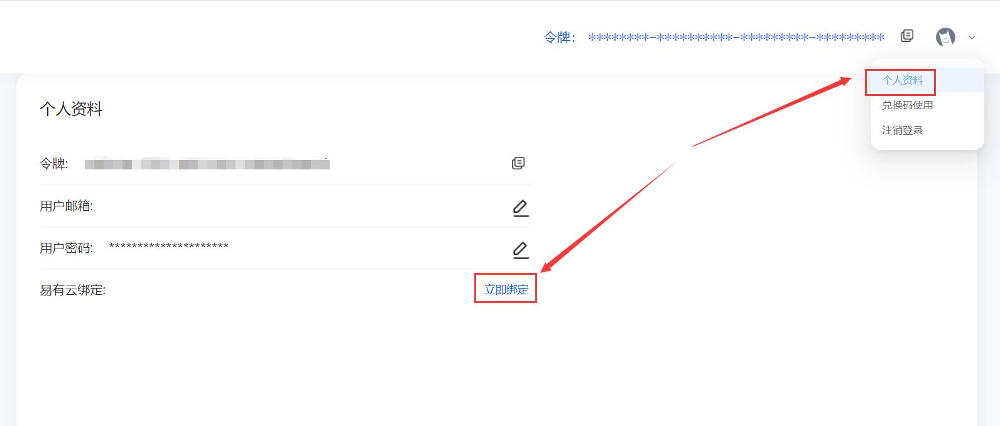
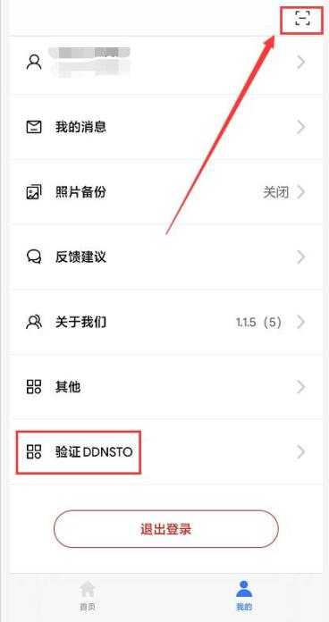
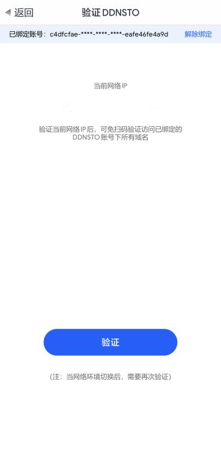

### 什么是身份验证？为什么要身份验证？

DDNSTO在保护用户数据安全同时也要避免恶意分享不良内容带来的法律风险，所以我们对用户的域名访问都做了认证判断：服务器会判断用户当前IP是否已经过验证，如果没有就会跳转验证流程。

所以当你的第三方客户端使用DDNSTO时，需要先访问一遍对应域名进行身份验证。否则客户端可能会出现连接失败或假死等错误。

### 验证方式，有2种：

#### A.登录ddnsto官网，访问控制台，微信扫码登录。

PS：这是最原始的方法，如果是纯手机端操作，很不方便，那么就说到第二种方法了。

#### B.最新版的易有云APP(安卓/iOS均已更新)验证DDNSTO。

[下载地址](https://www.ddnsto.com/linkease/download/#/)

PS：如果是易有云APP新用户，先进行注册，老用户直接更新最新版本即可。

#### 1.登录到DDNSTO控制台，登录后点击右上角用户头像，选择“个人资料——易有云绑定——立即绑定”，会出现一个二维码界面；

   
 
   
   
#### 2.打开“易有云APP——我的”，右上角二维码扫码，会提示绑定成功，然后点击“验证DDNSTO”，会提示已经绑定的账号和当前的IP；   

   

      

#### 3.绑定成功后，以后需要DDNSTO身份验证的时候，直接打开“易有云APP——我的——验证DDNSTO——验证”即可。

   
   