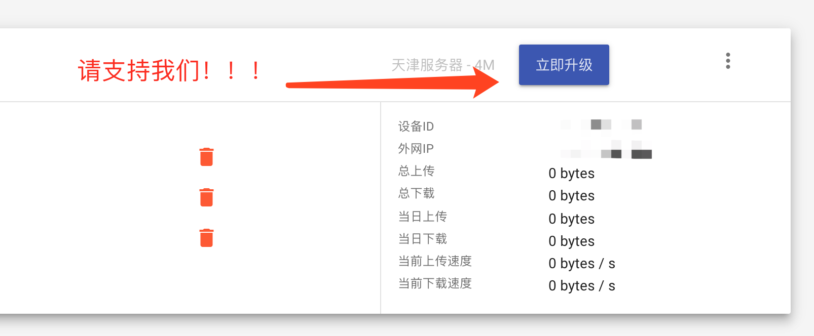

## 安装三步走

### Step1: 登录官网拿到 Token

TODO 一个高大上的原理介绍图。

### Step2: 快速安装 DDNSTO 到设备

有以下快速的方法：

1. Koolshare Merlin/LEDE 软件中心安装 DDNSTO
2. [Openwrt 一键安装脚本](https://firmware.koolshare.cn/binary/ddnsto/openwrt/)
3. 一个命令的 [Docker方式](https://github.com/linkease/docker_ddnsto)
4. [群晖离线包](https://firmware.koolshare.cn/binary/ddnsto/synology/)

安装好 DDNSTO 之后必须填入 Token

### Step3: 在官网后台设置域名

比如你的是 Openwrt，则填入子域名 openwrt，填入内网地址 http://127.0.0.1:80。

至此安装完成，后台界面会自动显示你的穿透域名，等一会，就可以远程访问啦。还可以切换 https http 两种地址，都可以试试看。

## 源代码

1. [Openwrt 插件源码](https://github.com/linkease/ddnsto-openwrt) 
2. [Openwrt 一键安装脚本源码](https://github.com/linkease/ddnsto_all_in_one_script)

## 常见问题

Q: ddnsto插件已配置， 但用户中心一直没有出现？

A: 请检查token(令牌)是否配置正确，或设备是否正常连接网络。或检查设备时间，时间不正确会导致连接失败，请同步时间后等待一分钟或重启插件。

Q: 域名绑定后无法访问内网服务，显示错误?

A: 配置域名、切换通道后需要等待1分钟左右，如长时间后仍然无法访问，请检查内网服务是否正常运行。

Q: 一定要微信登录验证才能访问？

A: 为了用户数据安全，目前只允许本人使用！

Q: 已购买套餐的设备不小心删除了怎么办？

A: 即使删除了设备，套餐依然还在。重新添加设备后就可以绑定已购买套餐。

还有任何问题都可以跟帖提问！

不知不觉DDNSTO已经累积了接近4W的用户，也得到了大家的广泛好评。为了提供更好的带宽和使用体验，我们将会陆续添加更多的服务器，同时新的功能也正在加紧开发，请大家拭目以待！

现在就点"立即升级"支持我们吧！帮助我们一起把DDNSTO做的更好！

# 更新日志

TODO

