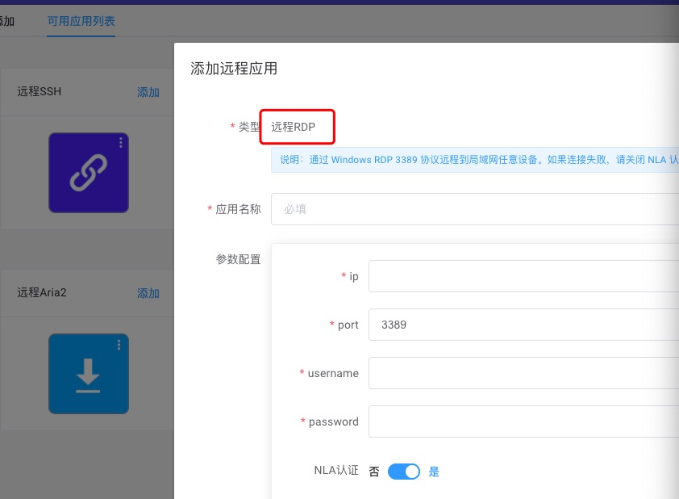

## 玩转应用中心
1.登录到https://www.ddnsto.com/。

2.通过前面的详细教程，已经配置好穿透。

3.右上角就点击远程应用，就能看到丰富的远程应用。

4.接下来我们就来玩转这些应用。

  
  
  

## 1.玩转Aria2远程下载

### Aria2配置：OpenWrt
1.首先确定你的路由等设备安装好了Aria2。
  
2.启用Aria2，RPC认证方式选令牌，然后自己输入一段英文数字乱码当作密钥，并复制下来(后面要用)，然后设置好下载目录，提交。
   
  PS：OpenWrt的RPC认证方式可选无，直接提交启用，然后跳转到“远程配置”，去设置远程下载。 
  
  
  
  

3.启用成功后，点击AriaNg控制台，并进入。

  

4. 进入AriaNg控制台，会发现状态未连接，那我们就来设置：先点击AriaNg设置，再点击RPC，地址填入路由IP，再填入密钥，重载界面就发现已经连接了。
 
  

    
  
5.然后跳转到“远程配置”，去设置远程下载。 

### Aria2配置：KS LEDE
1.在酷软中心安装Aria2。

  

2.设置好下载目录，并启用Aria2和开启RPC访问密钥，提交以后复制密钥(后面要用)。

  
  
3.启用成功后，点击AriaNg控制台，并进入。

  

4. 进入AriaNg控制台，会发现状态未连接，那我们就来设置：先点击AriaNg设置，再点击RPC，地址填入路由IP，再填入密钥，重载界面就发现已经连接了。
 
  

  

5.然后跳转到“远程配置”，去设置远程下载。   

  
### Aria2配置：KS 梅林
1.在软件中心安装Aria2。

  

2.开启Aria2和远程穿透连接，然后会自动配置RPC。
  
  

3.点击RPC设定，然后复制RPC密码/token(后面要用)。
  
  

4.然后跳转到“远程配置”，去设置远程下载。

   
### Aria2配置：群晖

TODO

### Aria2配置：威联通

TODO

### Aria2配置：爱快/Docker

TODO

### Aria2配置：老毛子Padavan

TODO

### Aria2配置：ReadyNAS
 
TODO 

 
### 远程配置  
1.在ddnsto可用应用列表中点击添加远程Aria2。

  填入RPC地址(格式为：路由IP:6800，比如http://192.168.2.2:6800/jsonrpc)
  
  password为前面复制的RPC密码/token(如果没RPC密码可不填，比如OpenWrt可不设置，就能远程)。
  
  

2.在已添加中找到刚添加的远程应用，点击即可进入Aria2操作界面。
  
  

  

3.Aria2操作界面新建填入要下载资源的地址即可远程下载了。 
 
   
  
  
   
  
## 2.玩转远程SSH
1.首先确定你的路由等设备开启了SSH。

2.在可用应用列表中点击添加远程SSH。

3.在弹出窗口写入应用名称，设备IP、设备登录用户名/密码等信息。

  PS：端口一般不需要改，除非你自己改了！
  
    

4.在已添加中找到刚添加的远程应用，点击即可进入设备的SSH。  
  
    
	
  
 
 
## 3.玩转远程Telnet
1.首先确定你的路由等设备开启了Telnet。

2.在可用应用列表中点击添加远程Telnet。

3.在弹出窗口写入应用名称，设备IP、设备登录用户名/密码等信息。

  PS：端口一般不需要改，除非你自己改了！
  
    

4.在已添加中找到刚添加的远程应用，点击即可通过Telnet进入设备的。  

  

  
## 4.玩转Windows RDP远程

  

  
## 5.玩转远程VNC

  TODO
 
 
## 6.玩转远程开机

  TODO