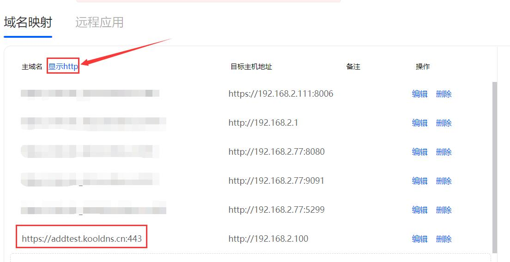
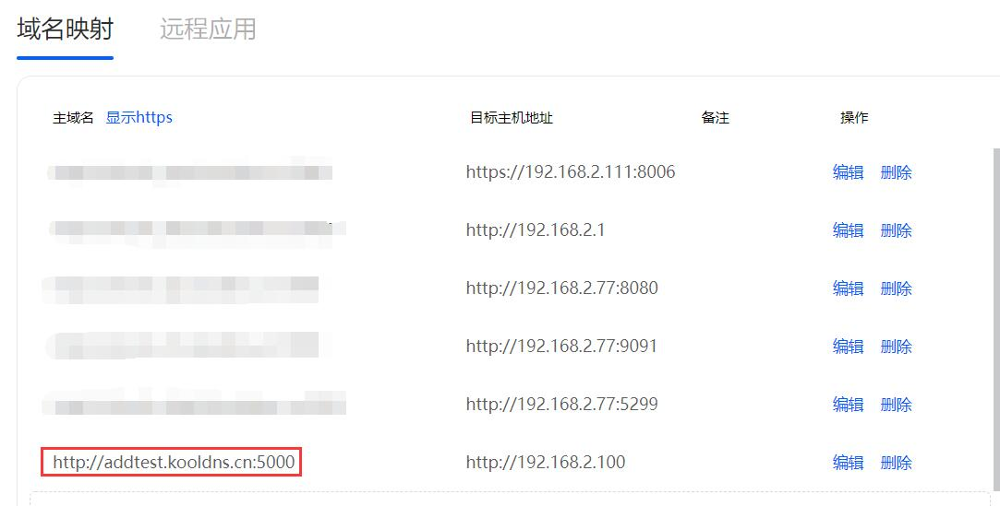
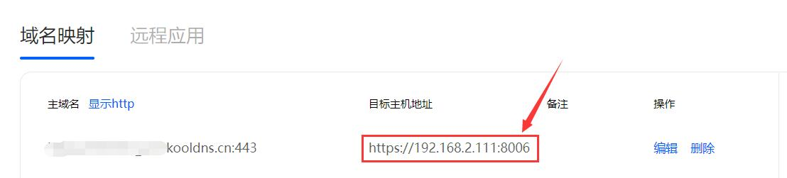
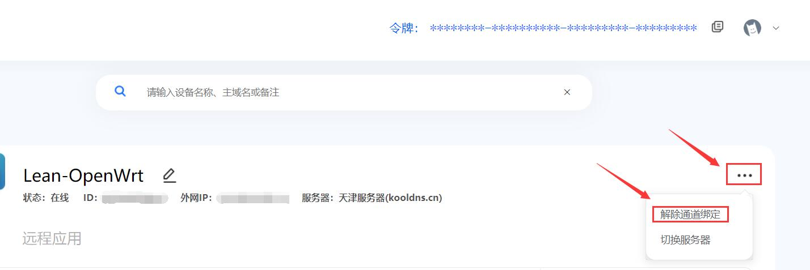
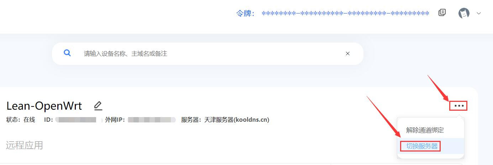
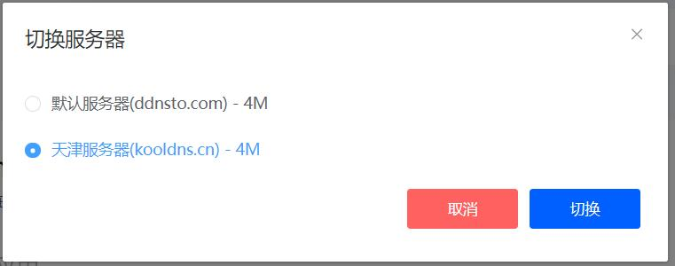
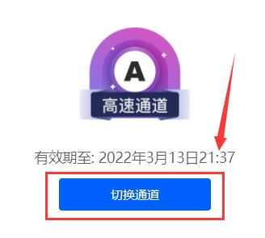
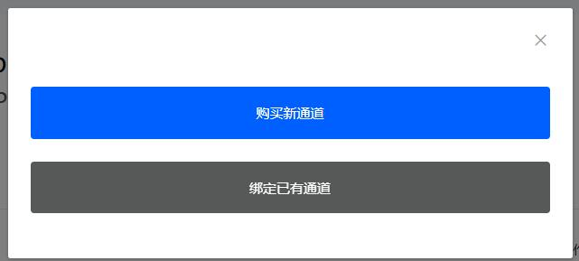
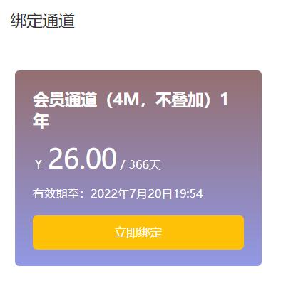
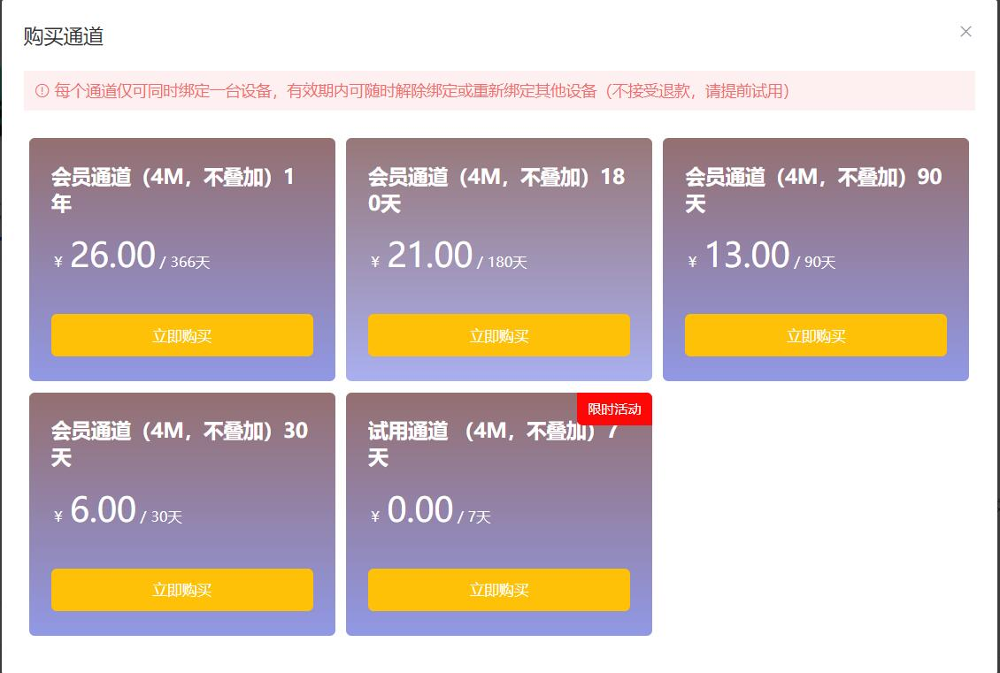

## 域名类

#### Q：ddnsto可以用自己的域名吗？

A：不可以，ddnsto会提供域名。

#### Q：域名http和https能同时访问吗？

A：可以，如果要同时访问，https和http地址端口不一样，可点击"显示http/https"切换查看。

     
      

   
#### Q：特殊设备访问需要填写端口？

A：是的，比如PVE虚拟机，默认端口是8006，就必须加上端口。

   

#### Q: 域名绑定后无法访问内网服务，显示错误？

A: 配置域名、切换通道后需要等待1分钟左右，如长时间后仍然无法访问，请检查内网服务是否正常运行。

## 登录类

#### Q: 一定要微信登录验证才能访问，Synology Drive无法用？

A: 为了用户数据安全，目前只允许本人使用！
A: Synology Drive 要用，必须先在浏览器当中验证一次

## 通道类

#### Q：解除设备的通道？

A：登录进ddnsto控制台，绑定的设备的右边有三个点，点击解除通道绑定。

   

#### Q：切换通道服务器？

 A：登录进ddnsto控制台，绑定的设备的右边有三个点，点击切换服务器，出来的弹窗就可以切换了。  

   
      
  
  
#### Q：切换通道？

 A：帐号已经买过通道，要绑定新设备，请先解除旧设备的通道。然后登录进ddnsto控制台，绑定好新设备后，右边会有切换通道的图标，点击出现弹窗，点击绑定已有通道，就能看到之前购买的通道，立即绑定。 
   
   
     
     

   
#### Q：购买新通道？

 A：登录进ddnsto控制台，绑定设备后，右边会有切换通道的图标，点击出现弹窗，点击购买新通道，按需购买通道。

   
     
     
 
 
#### Q: 已购买通道的设备不小心删除了怎么办？

A: 即使删除了设备，通道依然还在。重新添加设备后就可以绑定已购买通道。 
 
 
 
   
## 操作类

#### Q: ddnsto插件已配置，但用户中心一直没有出现？

A: 请检查token(令牌)是否配置正确，或设备是否正常连接网络。或检查设备时间，时间不正确会导致连接失败，请同步时间后等待一分钟或重启插件。

#### Q: Aria2远程下载无法设备正确？

A: 如果是www.kooldns.cn服务器，则设置为wss www.kooldns.cn。 

#### Q: 旁路路由无法使用DDNSTO？

A: 确认您旁路路由的内部是否能上网，试着ping www.baidu.com试试。

#### Q: 无法设备域名转发到小米路由器？

A: 是的，目前还无法解决。小米路由器的网页有特殊性导致无法转发WEB。 

#### Q: WordPress访问异常？

A: wordpress需要配置“站点地址”和ddnsto域名相同。

   

#### 还有任何问题都可以跟帖提问！
