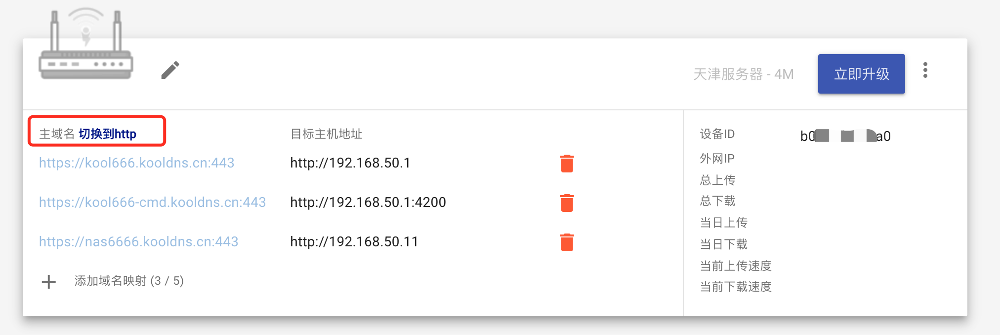
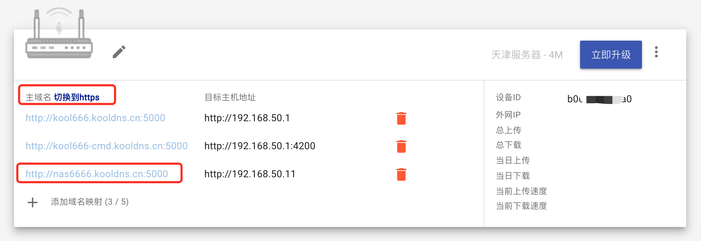

## 安装三步走

### Step1: 登录官网控制台拿到“令牌”

   

### Step2: 快速安装 DDNSTO 到设备

有以下快速的方法：

1. Koolshare Merlin/LEDE 软件中心安装 DDNSTO
2. [Openwrt 一键安装脚本](https://fw.koolcenter.com/binary/ddnsto/openwrt/)
3. 一个命令的 [Docker方式](https://github.com/linkease/docker_ddnsto)
4. [群晖离线包](https://fw.koolcenter.com/binary/ddnsto/synology/)

安装好 DDNSTO 之后必须填入 Token

### Step3: 在官网控制台设置域名

1. 用户中心出现设备后，点击添加域名映射"+"

   

2. 添加域名前缀，请使用小写字母或数字，并且大于6个字符。如前缀是"kool666666"，那么访问路由器的地址就是https://kool666666.ddnsto.com:443 ,在目标主机一栏填入路由器LAN口IP地址，如http://192.168.50.1:80 ( 端口如果是80，可以省略端口如：http://192.168.50.1 。非80端口则不能省略，如http://192.168.50.11:5000 ，请根据实际情况填写！)，填写完毕后点击"添加"。

   

   提交后可以看到完整的访问地址"https://kool666666.ddnsto.com:443"已经录入了！

   

   成功添加后请稍等1分钟左右即可正常访问。如果提交后立刻访问，可能会看到下面的错误页面，此时插件还正在重启。

   

3. 通过访问绑定的域名即可访问路由器，首次访问可能需要微信登录验证。

   

补充几种特殊设置说明

- merlin shellinabox插件设置

  shellinabox插件域名前缀的格式是固定的，是在你路由器的域名前缀后面添加“-cmd”，映射地址填路由器LAN口IP加端口4200。像我们前面设置的路由器前缀是kool666666，则shellinabox插件域名前缀就是“kool666666-cmd”，目标主机地址为http://192.168.50.1:4200

  

  

  成功！

  

- 群辉穿透设置(偷懒直接复制clang大神的教程了)

  因为使用https穿透后群辉的自动跳转会出现问题，所以需要自己补齐链接

  假如群辉的IP是192.168.50.11，并且绑定了域名https://nas666666.ddnsto.com/

  但这个链接是不能访问nas的！！！
  

  **需要在链接后加上** **webman/index.cgi 也就是说完整链接为：**
  **https://nas666666.ddnsto.com/webman/index.cgi**
  **用HTTP协议访问可以忽略上面的这个问题：http://nas666666.ddnsto.com:5000/ 这个就可以直接访问了，不需要手动补齐**

  点击切换到http即可方便的切换

  

  还可以来回切换 https和http呢！

  

