**此版块，主要说一些ddnsto的更多玩法，有很多朋友们，玩出了很多新花样，所以归纳一些比较常用的。**

## 远程穿透Jellyfin

Jellyfin是一个自由的软件媒体系统，用于控制和管理媒体和流媒体。

现在伙伴们的设备多样化性能也很强悍，所以有些伙伴部署了Jellyfin，打造个人媒体中心。那么我们也来穿透下，做成能远程能外网访问的个人媒体中心。

1.直接开始设置ddnsto，注意端口，若没有改默认端口那就是8096；
   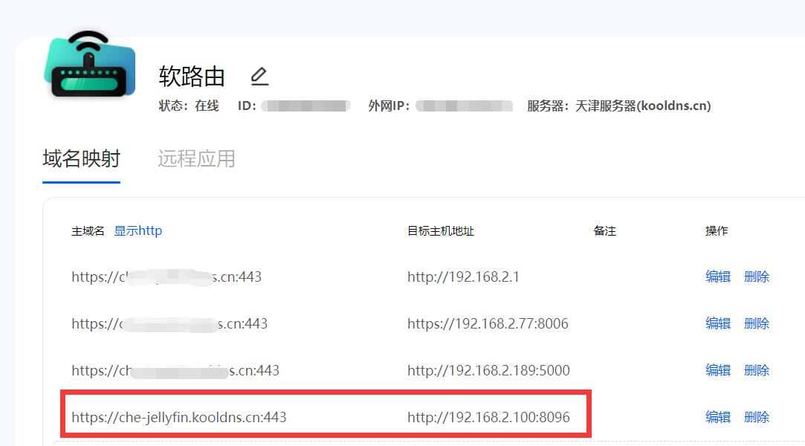

2.这样我们就能畅快的远程浏览个人媒体中心了。   

   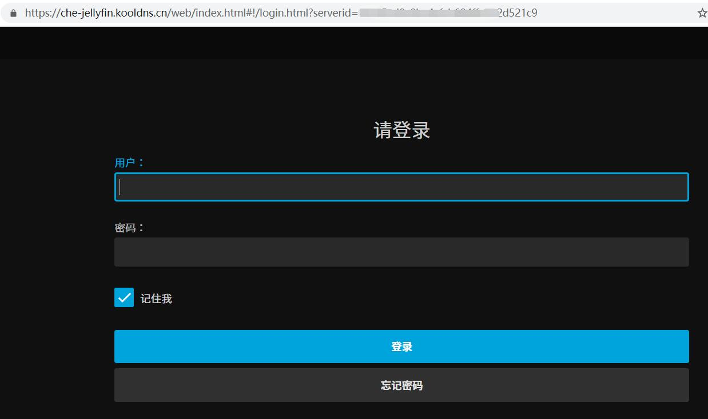
   
###  穿透Jellyfin APP

Jellyfin是有APP的，也能远程穿透，设置非常简单；

1.先进行ddnsto身份验证：

A：如果是在外网(指不是和群晖设备在同一局域网或者蜂窝数据下)，需要[身份验证](https://www.ddnsto.com/zh/guide/Authentication.html)。

B：如果在同一局域网下，不用验证ddnsto身份。

2.然后直接输入之前设置ddnsto穿透网址(去掉尾部端口)，回车即可穿透Jellyfin。

   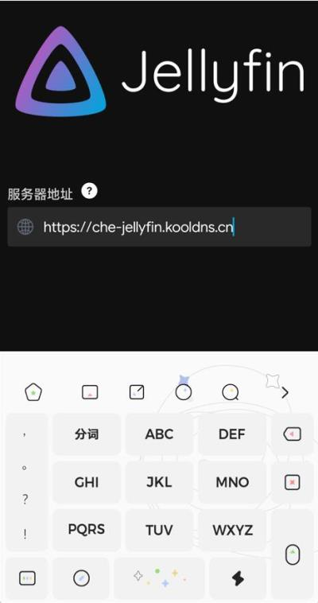

   
   
## 远程pve控制

基本现在很多人的小主机都是性能强悍的，通过通过PVE或者ESXI来安装各种系统(OpenWrt、iKuai、docker等)，只要通过PVE或者EXSI安装的OpenWrt/docker/LEDE等，部署好了ddnsto，那就就能远程访问PVE或者ESXI的管理界面。

   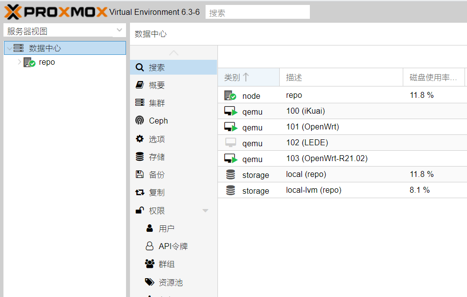
   
1.ddnsto设置好穿透，注意网址和端口即可。

PS：比如pve是https，别写成http了。

   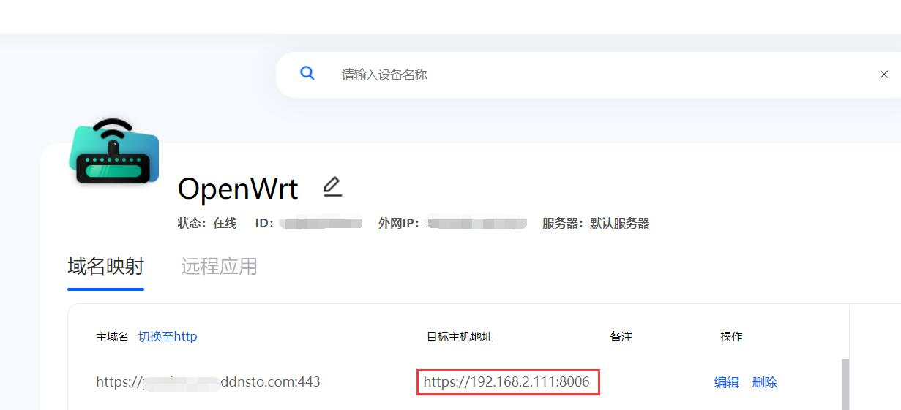
   
2. 很简单的步骤，就能畅快的远程管理PVE了。

   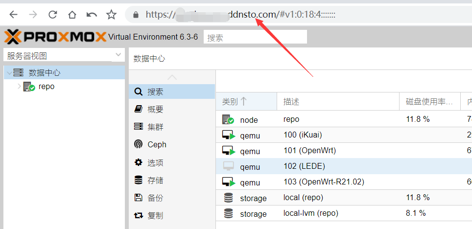
    
## qBittorrent远程下载

1.qBittorrent，一款bt下载插件，是能通过ddnsto远程控制的，注意下端口。

   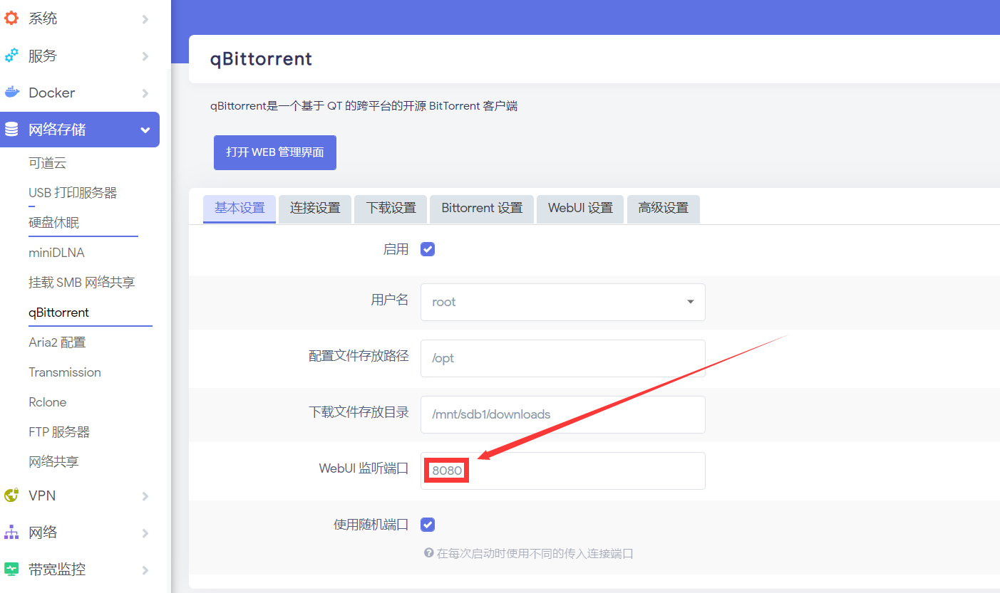
   
2.打开WEB管理界面，设置——WebUI——“取消”启用跨站请求伪造(CSRF)保护。

PS：此选项需要取消，不然后面ddnsto可能连不上。   
   
   
   
3.设置好qBittorrent的ddnsto远程穿透。

   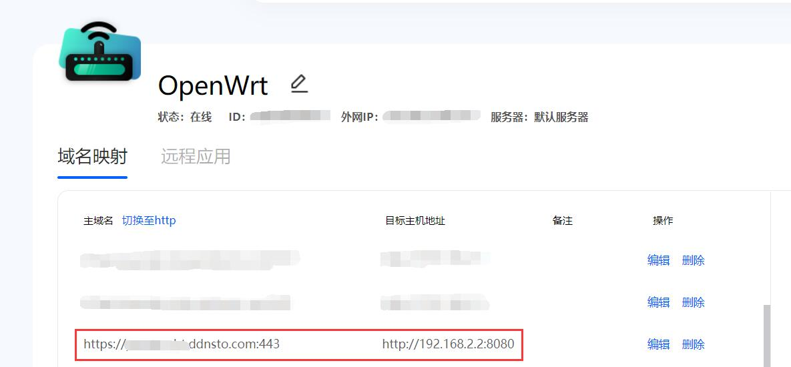

4.就能畅快的远程bt下载。

   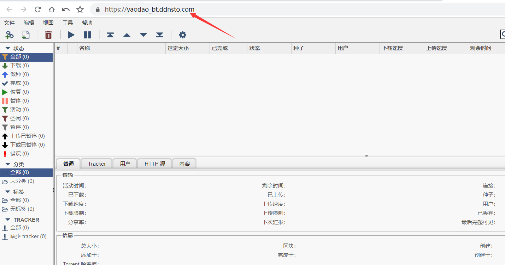  
   
## Transmission远程下载

1.Transmission也是一款bt下载插件，也能通过ddnsto控制。

   
   
2.设置好Transmission的ddnsto远程穿透。
   
   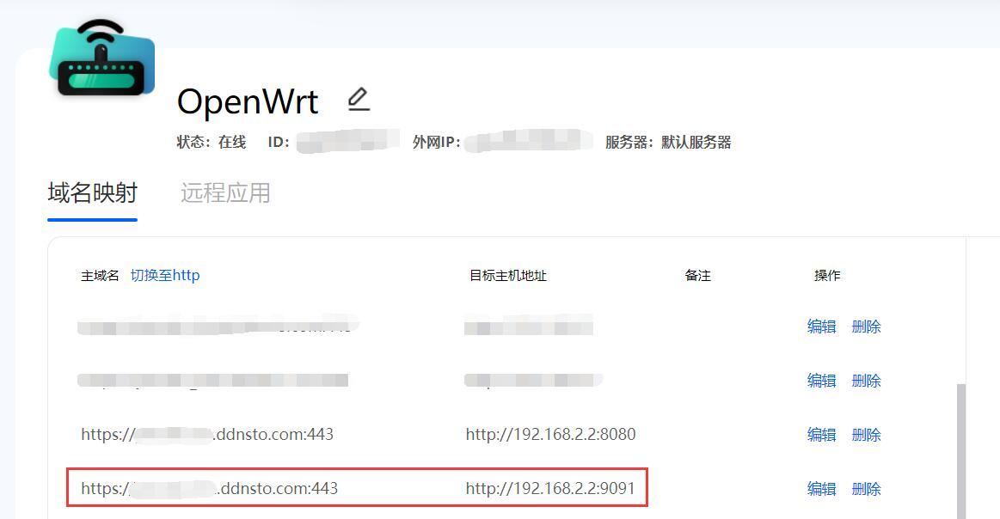
   
3.畅快的远程bt下载吧。 
 
   
   
## 百度云远程下载

1.BaiduPCS-Web是一款可以下载百度云的插件，也能通过ddnsto控制。

   
   
2.设置好BaiduPCS-Web的ddnsto远程穿透。
   
   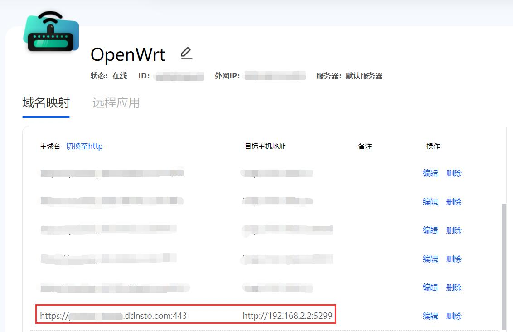
   
3.畅快的远程下载百度云吧。 
 
   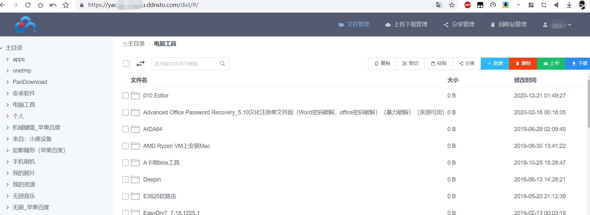  
   