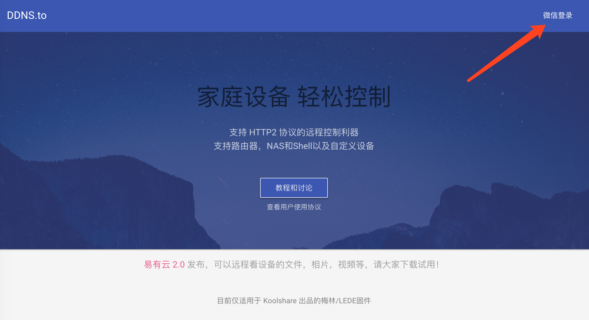
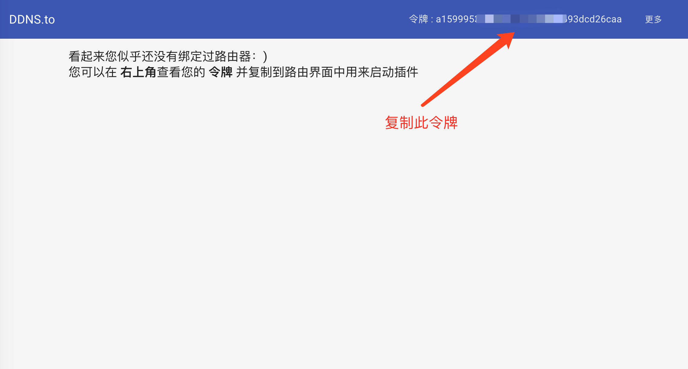
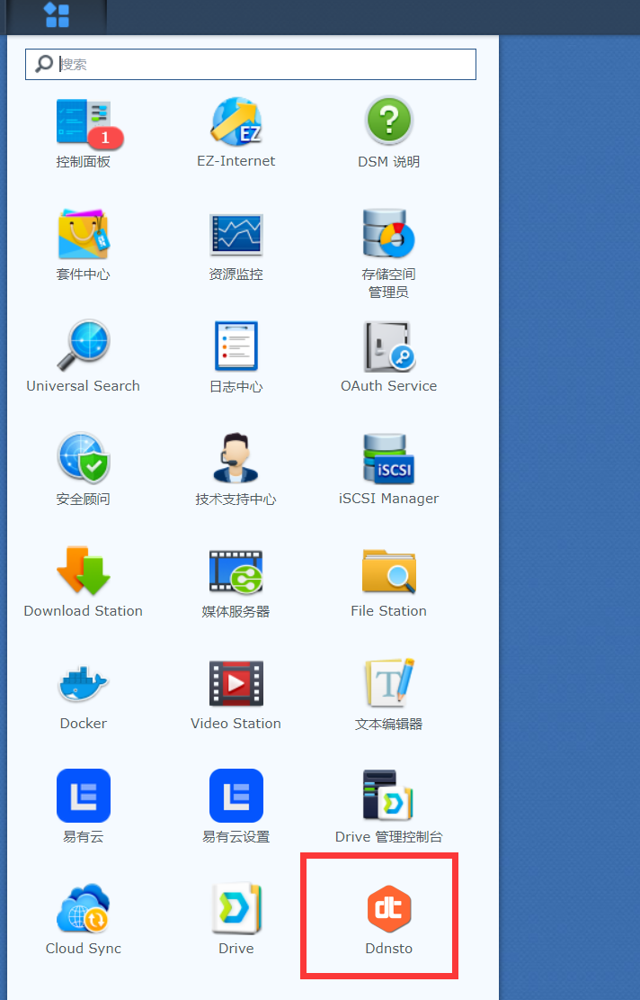
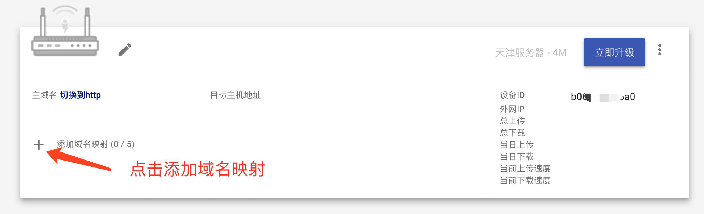
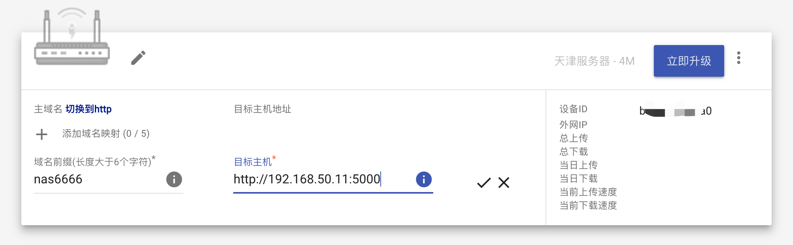
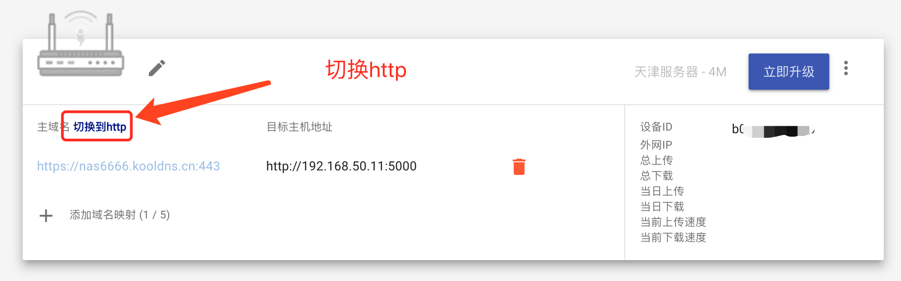
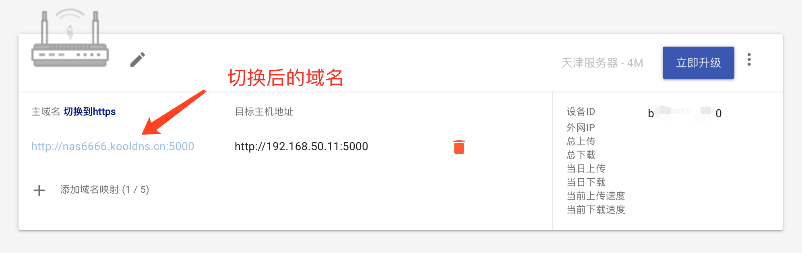

## 介绍

ddnsto由koolshare @小宝 开发。是一款快速稳定且简单易用的内网穿透工具。让用户在公司办公室、旅行途中都能够使用电脑或手机方便的访问家庭内的网络设备，如控制路由器开始下载最新电影、与NAS进行相册同步等操作。

目前市面上的穿透工具都有各种小缺点，像花生壳需要安装客户端并且要支付几百块钱的年费、frp需要自行购买云服务器并且配置过程对小白用户来说也比较复杂。

**ddnsto解决了常见穿透工具年费贵、配置复杂的问题，让小白用户几分钟就能搞定内网穿透。**

ddnsto的优秀之处：

1. 无需公网ip，不被网络环境限制。

2. ⽆需购买域名或服务器，省去了服务器年费和带宽要求以及域名购买、备案等等繁琐操作。

3. 全部的安装、配置都在浏览器完成，不需敲一行代码，对小白用户非常友好。

4. 支持http2，访问家庭内部网络速度更快！

   

   

 **最近刚完成了群晖套件的开发，赶紧试用起来吧！！！**

下载地址：[synology](https://firmware.koolshare.cn/binary/ddnsto/synology/) 

#### 交流群：

​												QQ交流群1~3群已满人，请加 ④群，群号: 8592-40701

## 设置步骤

### 获取Token

1. 打开ddnsto.com，点击右上角微信登录。

   

2. 登录成功后，复制右上角令牌(Token)

   

   ### 群晖设置 

   从https://firmware.koolshare.cn/binary/ddnsto/synology/下载套件并上传安装

   

   

   填入刚刚从官网复制的令牌(Token)，点击下一步完成安装

   

   即可在面板看到ddnsto！

   

   ### 穿透设置

   回到ddnsto.com用户中心，刷新等待设备出现在界面上。如长时间没有出现请查看【常见问题】

   

### 添加域名

1. 用户中心出现设备后，点击添加域名映射"+"

   

2. 添加域名前缀，请使用小写字母或数字，并且大于6个字符。如前缀是"nas6666"，在目标主机一栏填入群晖的IP地址，如http://192.168.50.11:5000

   

   提交后可以看到完整的访问地址"https://nas6666.kooldns.cn:443"已经录入了！

   **关键一步 !!! 请切换到http !!!**

   

   切换后如下图：

   

   下面解释一下为什么要切换成http：

   因为使用https穿透后群辉的自动跳转会出现问题，所以需要自己补齐链接

   假如群辉的IP是192.168.50.11，并且绑定了域名https://nas6666.kooldns.cn/

   但这个链接是不能访问nas的！！！

   **需要在链接后加上** **webman/index.cgi 也就是说完整链接为：**
   **https://nas6666.kooldns.cn/webman/index.cgi**
   **用HTTP协议访问可以忽略上面的这个问题：http://nas6666.kooldns.cn:5000/ 这个就可以直接访问了，不需要手动补齐**

   

   成功添加后请稍等1分钟左右即可正常访问。如果提交后立刻访问，可能会看到下面的错误页面，此时插件还正在重启。

   

## 通道和套餐

为了满足ddnsto更健康的发展，需要大家多多支持！现在推出了26 元一年的套餐，每个套餐可以绑定一台设备。

同时我们也增加了新的服务器(通道)以满足更多用户的稳定使用。

切换通道后，有几点需要注意的：

- 域名前缀也会随之改变，如现在除了原有的"ddnsto.com",还多了默认的"kooldns.cn"
- 切换通道后ddnsto插件会有1分钟左右的初始化时间，期间绑定的域名会不可用，请稍等再尝试
- 切换后原有的域名将不可使用，如"aaa.kooldns.cn"切换到了"aaa.ddnsto.com"之后，原有的"aaa.koolddns.cn"将不可使用。

## 常见问题

Q: ddnsto插件已配置， 但用户中心一直没有出现？

A: 请检查token(令牌)是否配置正确，或设备是否正常连接网络。或检查设备时间，时间不正确会导致连接失败，请同步时间后等待一分钟或重启插件。

Q: 域名绑定后无法访问内网服务，显示错误?

A: 配置域名、切换通道后需要等待1分钟左右，如长时间后仍然无法访问，请检查内网服务是否正常运行。

Q: 一定要微信登录验证才能访问？

A: 为了用户数据安全，目前只允许本人使用！

Q: 已购买套餐的设备不小心删除了怎么办？

A: 即使删除了设备，套餐依然还在。重新添加设备后就可以绑定已购买套餐。

还有任何问题都可以跟帖提问！

不知不觉DDNSTO已经累积了接近4W的用户，也得到了大家的广泛好评。为了提供更好的带宽和使用体验，我们将会陆续添加更多的服务器，同时新的功能也正在加紧开发，请大家拭目以待！

现在就点"立即升级"支持我们吧！帮助我们一起把DDNSTO做的更好！

