**此版块，主要说一些ddnsto玩转群晖的玩法，归纳一些比较常用的。**

## 远程穿透群晖App/程序

众所周知，ddnsto远程穿透超级简单，4M带宽足够使用，于是就有朋友想着利用ddnsto支持群晖App。

## 准备工作

**1.群晖设备已经配置好ddnsto穿透，前面详细教程有说到，已经配置了5000，能正常访问。现在新增一个80端口的配置(因为DS photo的App用的80端口)。**

   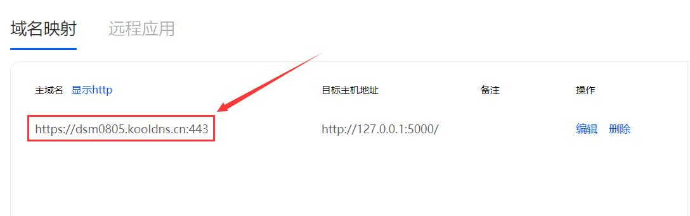 
  
**2.ddnsto身份验证：**

A：如果是在外网(指不是和群晖设备在同一局域网或者蜂窝数据下)，需要[身份验证](https://www.ddnsto.com/zh/guide/Authentication.html)。

B：如果在同一局域网下，不用验证ddnsto身份。

## 开始穿透(App)

### Synology Drive

先在群晖里安装并配置好Synology Drive套件；

   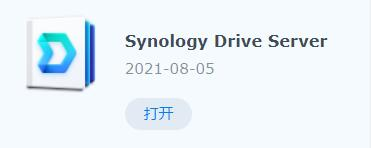
   
然后下载安装Synology Drive的App，打开App，地址栏填入5000端口的ddnsto域名(去掉https://和尾部端口)：dsm0805.kooldns.cn，帐号和密码均为群晖登录帐号和密码，不勾选HTTPS，登录就ok。   

   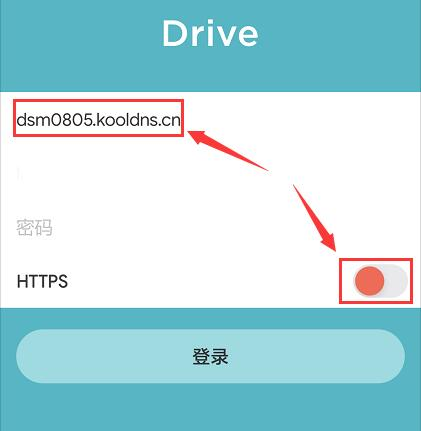

### Drive X

先在群晖里安装并配置好Synology Drive套件；

   
   
然后下载安装Drive X的App(群晖官网下载，目前仅有安卓版)，打开App，地址栏填入5000端口的ddnsto域名(去掉https://和尾部端口)：dsm0805.kooldns.cn，帐号和密码均为群晖登录帐号和密码，不勾选HTTPS，登录就ok。   

   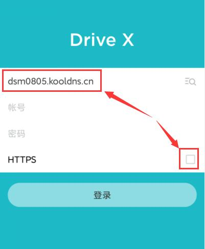   

   
   
### Synology Photos

先在群晖里安装并配置好Synology Photos套件；

   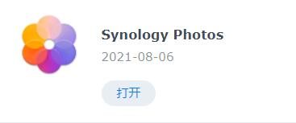
   
然后下载安装Synology Photos的App，打开App，地址栏填入5000端口的ddnsto域名(去掉https://和尾部端口)：dsm0805.kooldns.cn，帐号和密码均为群晖登录帐号和密码，不勾选HTTPS，登录就ok。   

   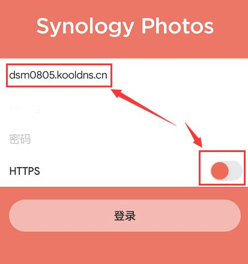   
   
   
### DS file

先在群晖里安装并配置好File Station套件；

   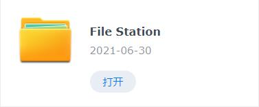
   
然后下载安装DS file的App，打开App，地址栏填入5000端口的ddnsto域名(去掉https://和尾部端口)：dsm0805.kooldns.cn，帐号和密码均为群晖登录帐号和密码，不勾选HTTPS，登录就ok。   

   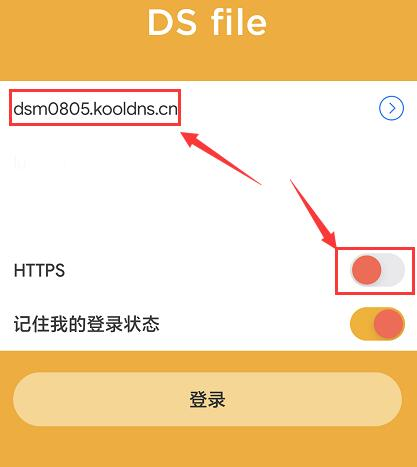 

### DS video

先在群晖里安装并配置好Video Station套件；

   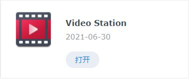
   
然后下载安装DS video的App，打开App，地址栏填入5000端口的ddnsto域名(去掉https://和尾部端口)：dsm0805.kooldns.cn，帐号和密码均为群晖登录帐号和密码，不勾选HTTPS，登录就ok。   

   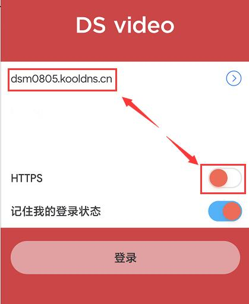 
   
   
### DS audio

先在群晖里安装并配置好Audio Station套件；

   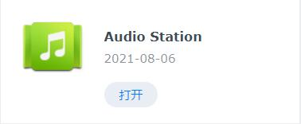
   
然后下载安装DS audio的App，打开App，地址栏填入5000端口的ddnsto域名(去掉https://和尾部端口)：dsm0805.kooldns.cn，帐号和密码均为群晖登录帐号和密码，不勾选HTTPS，登录就ok。   

   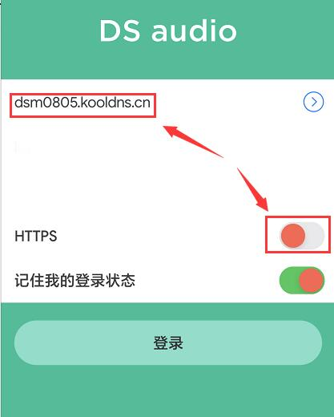    
   
   
### DS cam

先在群晖里安装并配置好Surveillance Station套件；

   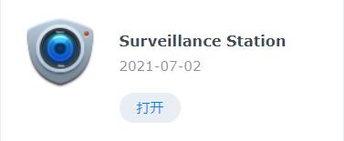
   
然后下载安装DS cam的App，打开App，地址栏填入5000端口的ddnsto域名(去掉https://和尾部端口)：dsm0805.kooldns.cn，帐号和密码均为群晖登录帐号和密码，不勾选HTTPS，登录就ok。   

   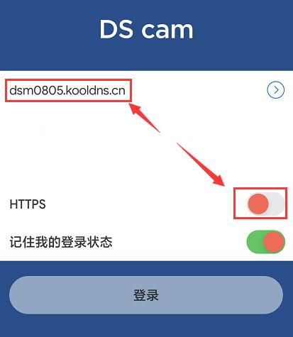 

   
### DS note

先在群晖里安装并配置好Note Station套件；

   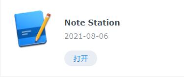
   
然后下载安装DS note的App，打开App，地址栏填入5000端口的ddnsto域名(去掉https://和尾部端口)：dsm0805.kooldns.cn，帐号和密码均为群晖登录帐号和密码，不勾选HTTPS，登录就ok。   

   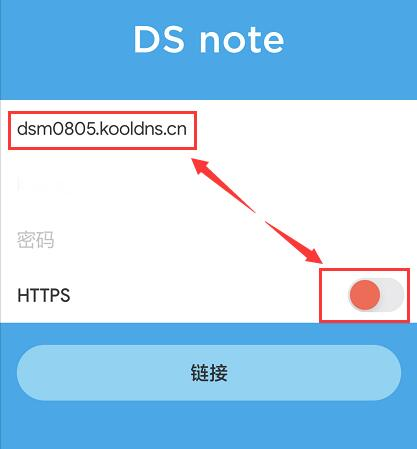 

### DS Photo

先在群晖里安装并配置好Photo Station套件；

   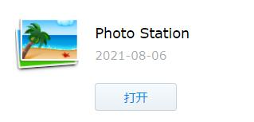
 
然后下载安装DS photo的App，打开App，地址栏填入80端口的ddnsto域名(去掉https://和尾部端口)+带上5000端口：dsm808080.kooldns.cn:5000，帐号和密码均为群晖登录帐号和密码，不勾选HTTPS，登录就ok。   

   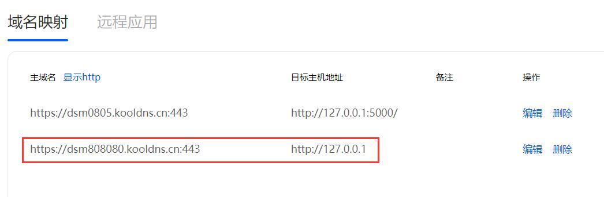   

   
## 开始穿透(PC客户端)

### Synology Surveillance Station Client

先在电脑上Synology Surveillance Station套件；

   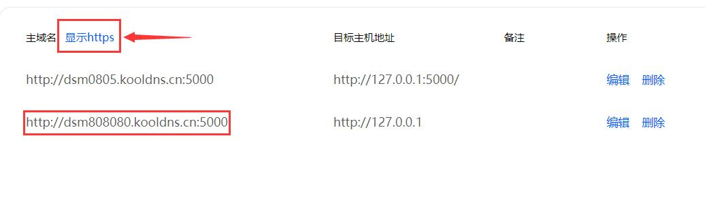
   
打开Synology Surveillance Station Client，地址栏填入5000端口的ddnsto域名(去掉https://)：dsm0805.kooldns.cn:443，帐号和密码均为群晖登录帐号和密码，登录就ok。   

ps:另外的Live View和Timeline设置也一样。

   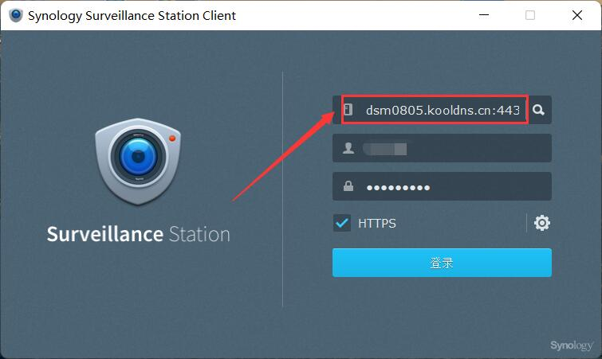 

   
### Synology Drive Client

目前建议用群晖自家的QucikConnect。

ddnsto远程穿透这个程序，目前没找到特别简单的方法。敬请期待后续更新...

  
