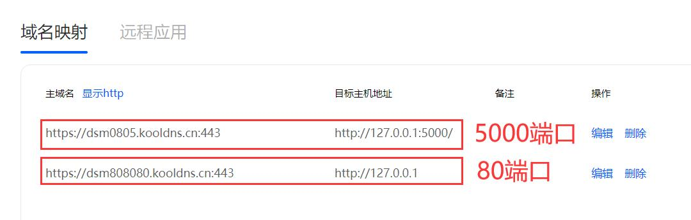

**此版块，主要说一些ddnsto玩转群晖的玩法，归纳一些比较常用的。**

## 远程穿透群晖App

众所周知，ddnsto远程穿透超级简单，4M带宽足够使用，于是就有朋友想着利用ddnsto支持群晖App。

**1.先说前提，群晖设备已经配置好ddnsto穿透，前面详细教程有说到，群晖设置ddnsto要配置端口，才能正常访问。**

   

**2.接下来开始准备工作，如图我的ddnsto群晖域名是 https://dsm0805.kooldns.cn:443 ，将这段 dsm0805.kooldns.cn 复制(就是去掉完整域名前面的https://和尾部的端口)。**

**3.ddnsto身份验证：**

A：如果是在外网(指不是和群晖设备在同一局域网或者蜂窝数据下)，需要浏览器打开https://www.ddnsto.com/进入控制台，验证身份登录。

B：如果和群晖在同一局域网下，不用验证ddnsto身份。

**4.准备工作做完，就可以开始下面的教程远程穿透群晖App了。**

### Synology Drive

先在群晖里安装并配置好Synology Drive套件；

   
   
然后下载安装Synology Drive的App，打开App，地址栏填入之前复制的dsm0805.kooldns.cn，帐号和密码均为群晖登录帐号和密码，不勾选HTTPS，登录就ok。   

   
   
   
### Synology Photos

先在群晖里安装并配置好Synology Photos套件；

   
   
然后下载安装Synology Photos的App，打开App，地址栏填入之前复制的dsm0805.kooldns.cn，帐号和密码均为群晖登录帐号和密码，不勾选HTTPS，登录就ok。   

      
   
   
### DS file

先在群晖里安装并配置好File Station套件；

   
   
然后下载安装DS file的App，打开App，地址栏填入之前复制的dsm0805.kooldns.cn，帐号和密码均为群晖登录帐号和密码，不勾选HTTPS，登录就ok。   

    

### DS video

先在群晖里安装并配置好Video Station套件；

   
   
然后下载安装DS video的App，打开App，地址栏填入之前复制的dsm0805.kooldns.cn，帐号和密码均为群晖登录帐号和密码，不勾选HTTPS，登录就ok。   

    
   
   
### DS audio

先在群晖里安装并配置好Audio Station套件；

   
   
然后下载安装DS audio的App，打开App，地址栏填入之前复制的dsm0805.kooldns.cn，帐号和密码均为群晖登录帐号和密码，不勾选HTTPS，登录就ok。   

       
   
   
### DS cam

先在群晖里安装并配置好Surveillance Station套件；

   
   
然后下载安装DS cam的App，打开App，地址栏填入之前复制的dsm0805.kooldns.cn，帐号和密码均为群晖登录帐号和密码，不勾选HTTPS，登录就ok。   

    

   
### DS note

先在群晖里安装并配置好Note Station套件；

   
   
然后下载安装DS note的App，打开App，地址栏填入之前复制的dsm0805.kooldns.cn，帐号和密码均为群晖登录帐号和密码，不勾选HTTPS，登录就ok。   

    

   