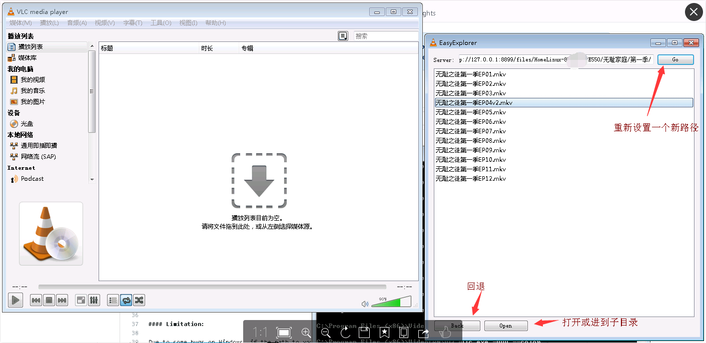

### 功能
直接直接在 vlc 上播放 EasyExplorer 的视频，支持拖动等

### 安装办法
Create a directory "extensions" at this location if it doesn't exists, then extract the file "vlsub.lua" from the archive inside:
把 easyext.lua 下载到 exensions 文件夹下，不存在则创建一个 extensions 文件夹，路径如下：
* Windows (all users): %ProgramFiles%\VideoLAN\VLC\lua\extensions\
* Windows (current user): %APPDATA%\vlc\lua\extensions\
* Linux (all users): /usr/lib/vlc/lua/extensions/
* Linux (current user): ~/.local/share/vlc/lua/extensions/
* Mac OS X (all users): /Applications/VLC.app/Contents/MacOS/share/lua/extensions/
* Mac OS X (current user): /Users/%your_name%/Library/Application Support/org.videolan.vlc/lua/extensions/

### 启动办法
* 直接启动 vlc
* 视图 --> EasyExplorer 
* 设置路径，默认是 http://127.0.0.1:8899/files/

### 效果图

